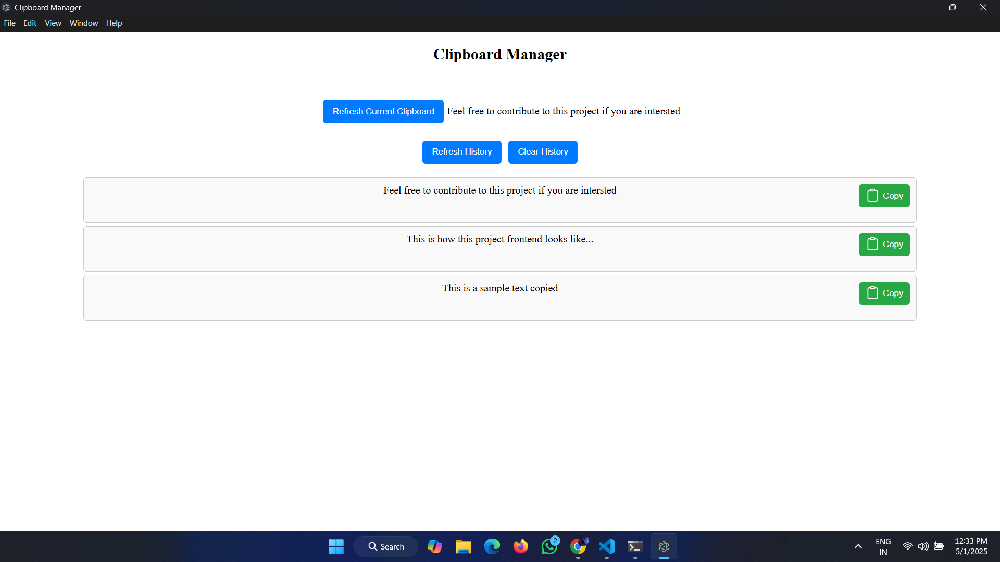

# Clipboard-Manager

## Overview
The **Clipboard-Manager** is a cross platform application that allows you to track, store, and manage your clipboard history. Users can view previously copied text , reuse it, or clear the history. This tool is perfect for those who want an easy way to manage their clipboard contents.

## How to use

### Build and Run
 - After cloning he repository , open the **Clipboard-Manager** solution in VS Code.
 - npm install then run the project.

```bash
cd Clipboard-Manager
npm run start
```

## FrontEnd



## Thank You
I hope this project helps you manage your clipboard history easily.
Thank you for using **Clipboard-Manager**